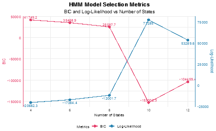

# Fall 2024 – Term Project Report

## CMPT 318 - Special Topics in Computing Science : Cybersecurity

### Group - 2

Sanchit Jain: <sja164@sfu.ca>

Priyansh Sarvaiya: <pgs3@sfu.ca>

Daiwik Marrott: <drm11@sfu.ca>

Luvveer Singh Lamba: <lsl11@sfu.ca>

## Abstract
This study proposes an unsupervised intrusion detection approach using time series analysis. The methodology employs feature scaling and Principal Component Analysis for data preprocessing, followed by Hidden Markov Model (HMM) training with various state configurations. Model selection is based on Log-likelihood and Bayesian Information Criterion. Anomaly detection thresholds are established to identify suspicious patterns in network traffic. Experimental results validate the effectiveness of the proposed methodology for unsupervised intrusion detection

## Table of Contents
[1. Problem Statement	3](#_toc183372080)

[2. Methodology	3](#_toc183372081)

[2.1 Data Preprocessing	3](#_toc183372082)

[2.2 Feature Engineering & Dimensionality Reduction	4](#_toc183372083)

[2.3 Model Training & Testing	4](#_toc183372084)

[2.4 Anomaly Detection	5](#_toc183372085)

[2.5 Visualization & Analysis	6](#_toc183372086)

[3. Characteristics & Rationale of the Solution	6](#_toc183372087)

[3.1 Data Preprocessing & Cleaning	6](#_toc183372088)

[3.2 Dimensionality Reduction & Feature Selection	7](#_toc183372089)

[3.3 Split of Training & Testing Data	11](#_toc183372090)

[3.4 Model Design	12](#_toc183372091)

[3.5 Anomaly Detection	13](#_toc183372092)

[4. Problems Encountered & Lessons Learned	15](#_toc183372093)

[5. Conclusion	17](#_toc183372094)

[6. References	18](#_toc183372095)

## Table of Figures
1. Table (1): Number of NA values and anomalies
1. Graph (1): Cosine biplot of PCA results
1. Table (2): Matrix of PCA variance
1. Figure (1): Correlation plot between chosen responses
1. Graph (2): Scree biplot of PCA cumulative variance
1. Graph (3): Average all variable distribution for selected time window
1. Graph (4): Average chosen variable distribution for selected day
1. Table (3): Log-likelihood and BIC values for multiple HMM states
1. Graph (5): HMM Model selection metrics
1. Graph (6): Graph of injected anomalies
# 1. Problem Statement
The increasing reliance on automated control systems in critical infrastructure, such as electric power grids, introduces vulnerabilities to adversarial threats. These systems, integral to cost efficiency and safety, are exposed to sophisticated attacks that exploit operational anomalies. However, detecting such anomalies is complex due to several external factors, including missing or corrupted data, the absence of labeled ground truth, and the need to balance precise anomaly detection while minimizing false positives.

This project addresses the challenge of designing and evaluating an unsupervised anomaly detection framework using HMMs applied to time series data from electric energy systems. 
# 2. Methodology
This study utilizes HMMs to detect anomalies in time series data of electric energy consumption. The methodology includes data preprocessing, feature selection, model training and testing, and anomaly detection.
## 2.1 Data Preprocessing
The provided dataset was preprocessed to address missing/NA values and ensure data integrity.

1. **Linear Interpolation:** Missing values in columns with numerical features were filled using linear interpolation.
1. **Outlier Detection and Removal:** Z-scores were calculated for each numeric feature to identify outliers Z-score>3. Observations containing such anomalies were excluded from further analysis.
1. **Feature Scaling:** The remaining numeric features were scaled with the standardization method.
1. **Splitting Dataset:**
   1. **Training Data:** Observations of roughly 2 years, representing approximately 110 weeks of data based on the preprocessed data, were used as training dataset.
   1. **Testing Data:** Observations of roughly 1 year, representing approximately 44 weeks, were reserved for testing.
## 2.2 Feature Engineering & Dimensionality Reduction
Principal Component Analysis (PCA) was applied to the scaled numeric data to reduce the dimensionality of the training dataset and select the most significant variables for training HMMs.

1. **PCA Results:** The PCA identified variables contributing the most to variance. Loading scores were computed to identify variance distribution based on the eigenvalue of each variable with respect to others.
1. **Variable Selection:** Based on the PCA loading scores, 3 numerical features were chosen for modeling.
1. **Visualizations:** PCA values were plotted across different variables to understand the variance of different responses across the training dataset.
1. **Temporal Correlation:** Correlation matrices were computed for each time window (ranging from 2 to 6 hours) across different weekdays (from Saturday to next Friday). 
## 2.3 Model Training & Testing
HMMs were trained using the depmixS4 R package.

1. **Model Configuration:** Since the selected response variables across the selected time window follow a continuous distribution, the multivariate HMMs were configured with Gaussian response families.
1. **State Exploration:** Models with varying numbers of states (4, 6, 8, 10, and 12) were trained and evaluated.
1. **Evaluation Metrics:** The models were assessed using log-likelihood and Bayesian Information Criterion (BIC) to identify the best-performing configuration. 
1. **Visualizations:** Results from evaluation metrics across different states were plotted to understand the best state number configuration for the model. 
1. **Finetuning Model Parameters:** Parameters from the trained model were retrieved using getpars(). Parameters from the trained model were transferred to the test model using the setpars() function, ensuring consistency in state distributions and transitions. 
1. **Model Evaluation on Test Data:** The forward-backward algorithm was executed on the test data to compute log-likelihood values for each observation sequence. This log-likelihood was computed and compared to the normalized log-likelihood of the training data.
## 2.4 Anomaly Detection
The trained HMM was applied to detect anomalies in test data.

1. **Log-Likelihood Threshold:** The log-likelihood of the training data was normalized and used to establish a threshold. The maximum deviation from the normalized log-likelihood was calculated across test subsets to define this threshold. The test dataset was divided into 10 consecutive weekly subsets and log-likelihood values for each dataset were computed.
1. **Anomalous Behavior Identification:** Maximum deviation from training log-likelihood values was computed and threshold was empirically computed.
1. **Anomaly Injection:** Synthetic anomalies were injected into the dataset. The injected anomalies were designed to mimic point anomalies that included sudden spikes or drops in individual features like Global\_active\_power and temporal anomalies that had sustained deviations across specific time intervals.

## 2.5 Visualization & Analysis
Results were visualized to assess the model’s performance.

1. **Log-likelihood Trends:** Log-likelihood values for test subsets were plotted alongside established thresholds to identify deviations.
1. **Normalized Log-Likelihood:** Normalized log-likelihoods were similarly analyzed to quantify the severity of anomalies.
# 3. Characteristics & Rationale of the Solution
## `	`3.1 Data Preprocessing & Cleaning
`		`Characteristics

1. **Missing Values:** Missing values in critical features such as Global\_active\_power, Global\_reactive\_power, Voltage, Global\_intensity, Sub\_metering\_1, Sub\_metering\_2, and Sub\_metering\_3 were computed using linear interpolation.
1. **Outlier Removal:** Z-scores were computed for all numeric features to detect anomalies. 7% of the total data points were found unfit for further analysis.
1. **Standardization:** Standardization was applied to all numeric features using scale ().

|Type of Datapoints| Number | % of dataset|
|Datapoints with NA values|50112|3\.2%|
| :- | -: | -: |
|Datapoints considered Anomalous|111088|7\.13%|

Table (1)

Rationale

1. Feature Scaling is a vital preprocessing step when Machine learning algorithms are used as it aims to standardize the range of all the independent variables in the dataset. Essentially, it transforms all the data into a common scale which improves the accuracy and performance of the models being used.
1. Standardization, a form of scaling is used to transform the features of the dataset to have $\mu = 0 (mean)$ and $\sigma = 1 \text{(standard deviation)}$ by clustering the data around the mean. It helps to make the data robust to outliers due to the clustering of the data without altering the range too drastically. It helps us to compare the features more effectively by reducing the noise. 
1. Normalization is used to transform features to a specific range, typically between 0 and 1. This technique is useful for datasets that do not follow a Gaussian distribution, as it maintains the relationships between features. However, normalization is sensitive to outliers, which can distort the scaled data and lead to less reliable results.
1. Z-score-based outlier removal identifies and excludes extreme anomalies that can negatively impact model training. A $\Z-score > 3$ indicates that a data point is more than three standard deviations away from the mean, placing it in the top `0.3%` of the distribution and signaling potential anomalous behavior. This method leverages the standardized data scale, ensuring consistent and accurate detection of outliers across all features. By removing these extreme values, the model becomes more robust and less biased during training.
## 3.2 Dimensionality Reduction & Feature Selection
`		`Characteristics

1. **Principal Component Analysis (PCA):** The first three principal components `PC1, PC2, and PC3` explained `68.57%` of the total variance (as shown in `graph 2`).
1. **Selected Features:** Based on PCA loadings, `Global_active_power, Sub_metering_3, and Global_reactive_power` were identified as the most significant features and used for HMM training.

Rationale

1. PC1, PC2, and PC3 were selected since they explain the majority of the dataset. Their distribution for the selected time windows is consistent with the distribution of these variables observed throughout the dataset and aligns with the rationale from domain knowledge. 

Graph (1)

1. `Global_active_power` stands as the high-magnitude cornerstone variable, demonstrated by its significant PCA loadings across multiple components `(PC1: -0.497, PC6: 0.703, PC7: -0.423)` as shown in Table 2. The temporal visualization (red line shown in `Graph 3 & 4`) shows distinct daily patterns with sharp morning transitions around 08:00, exhibiting the highest magnitude among selected variables. Its well-balanced statistical distribution `(Min: -1.197, Max: 3.838, Mean: 0.01576)` with evenly spread quartiles `(1st Qu.: -0.785, 3rd Qu.: 0.612)` makes it ideal for capturing significant state transitions while avoiding the extreme outliers seen in variables like `Global_intensity (Max: 4.311)` or `Sub_metering_1 (Max: 28.308)`.
2. `Global_reactive_power` serves as the low-magnitude variable, providing essential fine-grained information with distinct PCA loadings `(PC2: -0.687, PC5: 0.671)` in entirely different components. The time series plot (green line in `Graph 4` & blue line in `Graph 3`) reveals consistent low-magnitude fluctuations, showing the lowest values and smallest variations. Its near-zero correlations with both `Global_active_power (-0.019)` and `Sub_metering_3 (-0.029)` confirm its independence `(Figure 1)` in capturing unique power characteristics. The statistical distribution shows well-defined bounds `(Min: -1.150, Max: 3.462, Mean: 0.008)` with balanced quartiles `(1st Qu.: -1.150, 3rd Qu.: 0.711)`, making it more suitable for HMM training than `Voltage`, which shows excessive deviation `(Min: -3.270, Max: 3.106)`.
1. `Sub_metering_3` provides crucial medium-range information, demonstrated by its significant PCA loadings `(PC1: -0.490, PC6: -0.700, PC7: -0.416)` as shown in `table 2`. The temporal visualization (purple line in `Graph 3` & blue line in `Graph 4`) shows distinct patterns with gradual morning increases and stable daytime values, operating in a middle range between active and reactive power. Its statistical distribution `(Min: -0.709, Max: 3.075, Mean: 0.004, Median: -0.587)` provides remarkably more balanced coverage compared to `Sub_metering_1 (Max: 28.308)` and `Sub_metering_2 (Max: 15.955)`. The moderate correlation with `Global_active_power (0.545)` while maintaining independence from `Global_reactive_power` indicates its complementary nature in capturing overall consumption patterns.
1. This three-tier structure (high, medium, low) creates an optimal feature set because: 
   
   a. Their complementary value ranges (all within approximately -1.20 to +3.5 units) provide multi-scale representation of power consumption.
   
   b. Their well-balanced statistical distributions (means near zero: 0.016, 0.008, 0.004) ensure stable model training.
   
   c. Their distinct but complementary PCA loadings across multiple components capture different aspects of power consumption.
   
   d. Their correlation structure (two independent variables and one moderately correlated) ensures comprehensive coverage without redundancy.
   
   e. Their temporal patterns show clear daily structures while maintaining different scales of variation, suggesting effective capture of different state transitions.

|PCA Metric|PC1|PC2|PC3|PC4|PC5|PC6|PC7|
| :- | :- | :- | :- | :- | :- | :- | :- |
|Standard deviation|1\.6047|1\.1187|0\.9867|0\.8761|0\.8438|0\.72858|0\.4356|
|Proportion of Variance|0\.3679|0\.1788|0\.1391|0\.1096|0\.1017|0\.07583|0\.0271|
|Cumulative Proportion|0\.3679|0\.5466|0\.6857|0\.7954|0\.8971|0\.97290|1\.0000|

Table (2)

Figure (1)

Graph (2)

Graph (3)

Graph (4)

## 3.3 Split of Training & Testing Data
Characteristics

1. **Time Window**: The time window `(6:00 AM to 9:00 AM on Fridays)` was chosen.
1. **Training Data**: The training dataset includes observations from `December 16, 2006`, to `January 24, 2009`, covering approximately `110 weeks` of data.
1. **Testing Data**: The testing dataset spans `January 25, 2009, onward`, encompassing roughly `44 weeks`.

Rationale

1. The training data spans a significant period (over two years) on the selected time window, allowing the HMM to learn diverse energy consumption patterns across weekdays, weekends, seasons, and other temporal variations.
1. Sufficient data ensures that the HMM effectively captures underlying probabilistic state transitions, reducing the risk of overfitting to short-term patterns.
1. By ensuring the test dataset comes from a time range following the training dataset, the model's performance can be assessed under conditions of temporal drift, which is common in energy consumption patterns due to changing user behavior or external factors like weather.
1. The selected time window was chosen based on observed temporal correlations and consistent energy usage patterns. By maintaining this focus in both datasets, the model avoids being influenced by irrelevant data, ensuring a more accurate detection of anomalies.
## 3.4 Model Design
Characteristics

1. **State Configuration:** A range of state counts `(4, 6, 8, 10, 12)` was explored. Each configuration was evaluated using log-likelihood and Bayesian Information Criterion (BIC). The `6-state HMM` was selected for its balance of performance and complexity, achieving a `log-likelihood of -17384.45` and a `BIC of 35468.91(Table 3)`.
1. **Gaussian Emissions:** The response variables were modeled using Gaussian distributions, aligning with the continuous nature of energy consumption data.
1. **Parameter Reuse:** Parameters from the trained model were transferred to the test model, ensuring consistency in transition probabilities and state distributions during testing.

Rationale

1. The selected variables are continuous in nature. Gaussian distributions were chosen for their ability to well-approximate such data that show natural variability like energy consumption. The Gaussian response family allows the model to capture the probabilistic nature of energy consumption at different states, such as typical or anomalous usage patterns.
1. Models with different numbers of states were trained and evaluated to identify the best configuration. The number of states in an HMM essentially controls the granularity of the model’s representation of underlying patterns in the data. The `6-state model` was chosen based on the balance between model complexity and fit. Evaluation metrics like log-likelihood and BIC showed that the model was neither overfitting nor underfitting, making it optimal for capturing typical consumption patterns while avoiding unnecessary complexity.
1. Once the optimal 6-state model was selected, the parameters (state transition probabilities and emission distributions) from the trained model were transferred to the test model using the `setpars()` function. This ensured that the model's behavior remained consistent across training and testing phases, which is essential for assessing its performance on unseen data without introducing bias or inconsistencies.

|States|Log-Likelihood|Bayesian Information Criterion|
| -: | -: | -: |
|4|-20682|41749|
|6|-17384|35469|
|8|-12002|25098|
|10|77285|-153002|
|12|53290|-104459|

Table (3)

Graph (5)

## 3.5 Anomaly Detection
Characteristics

1. **Log-Likelihood Threshold:** The log-likelihood of the test data was compared to that of the training data to identify deviations. A normalized log-likelihood threshold was defined based on the maximum deviation observed in the test subsets. 
1. **Subset-Based Analysis:** The test dataset was divided into `10 equal-sized subsets` to capture temporal patterns. Deviations in log-likelihood for each subset were computed.
1. **Threshold Definition**: A threshold of `-17452.07 (log-likelihood)` and `–1.005208(normalized log-likelihood)` was established, flagging observations with significant deviations as anomalies.
1. **Anomaly Injection**: Synthetic anomalies were introduced to the test data to evaluate the robustness of the framework. These included:
   1. `Point Anomalies`: Sudden spikes or drops in specific features like `Global_active_power` as shown in `Graph 6`.
   1. `Temporal Anomalies`: Sustained deviations in patterns over extended periods.

Graph (6)

Rationale

1. Log-likelihood was chosen as the primary metric for anomaly detection since it can quantify how well a particular observation fits the learned distribution of normal behavior. Observations with low log-likelihood values indicate that the model has not learned to represent the observed data well, which suggests potential anomalies. Hence, sudden spikes or gradual shifts in data behavior will be captured as low log-likelihood.
1. A threshold for identifying anomalies was empirically derived by calculating the maximum deviation ($\Delta_{max}$) between the log-likelihoods of training data and test data. This approach ensures that the threshold is contextually based on the distribution of the training data, making it adaptable to variations in energy consumption while avoiding arbitrary or static thresholds.
1. The subdivision of test dataset into `10 consecutive weekly subsets` allows for a more granular detection of anomalies. Such temporal subset analysis reflects the need for anomaly detection to be adaptive over time, especially for systems like energy grids where consumption patterns may evolve gradually (e.g., seasonal changes, holidays, or behavioral shifts).
1. The model’s robustness was further validated by injecting synthetic anomalies into the dataset. This allowed for controlled testing of the framework's ability to detect known deviations, ensuring that it could accurately flag both synthetic anomalies and naturally occurring deviations in the data.
# 4. Problems Encountered & Lessons Learned
Challenges

1. **Dimensionality Reduction:**
   1. **Feature Selection via PCA:** Identifying the most relevant features for HMM training was challenging due to the complexity of energy consumption patterns and the need to balance dimensionality reduction with preserving essential variance.
1. **Model Training:**
   1. **State Configuration Selection:** Training HMMs with varying numbers of states and evaluating log-likelihood and BIC metrics required significant computational resources. Finding the optimal 6-state configuration involved iterative experimentation and tuning.
   1. **Parameter Convergence:** Ensuring convergence of HMM parameters during training were time-intensive, particularly for configurations with higher state counts, as the optimization process occasionally stalled or produced non-convergent results.
1. **Threshold Determination:**
   1. **Dynamic Thresholds for Anomaly Detection:** Establishing a robust threshold for log-likelihood deviations required iterative testing to balance false positives and false negatives. Sudden spikes in energy consumption or seasonal changes added complexity to threshold determination.
1. **Anomaly Injection:**
   1. **Realistic Anomaly Simulation:** Designing synthetic anomalies that realistically mimic real-world deviations (e.g., point anomalies and temporal anomalies) was challenging. The injected anomalies needed to be diverse enough to evaluate the robustness of the framework effectively.

Lessons

1. **Feature Engineering Matters**: Dimensionality reduction techniques like PCA not only simplify the model but also enhance interpretability. Selecting features with complementary statistical properties improves the model’s ability to capture distinct patterns.
1. **Model Configuration is Crucial**: Choosing the optimal number of HMM states are a balance between complexity and performance. Using evaluation metrics like log-likelihood and BIC ensures that the model generalizes well without overfitting or underfitting.
1. **Thresholds Should Be Data-Driven**: Empirical methods for determining thresholds, such as calculating maximum log-likelihood deviation, are more effective than static thresholds. Dynamic thresholds improve adaptability to changing consumption patterns.
1. **Anomaly Injection Validates Robustness**: Injecting synthetic anomalies provides an effective way to test and refine the model. Including diverse anomaly types (point and temporal anomalies) ensures that the framework can detect a wide range of deviations.
1. **Iterative Refinement Yields Better Results**: Each phase of the project—preprocessing, model training, threshold determination, and anomaly detection—benefited from iterative refinement. Regular evaluations and adjustments led to a more robust and effective solution.
# 5. Conclusion
The unsupervised intrusion detection approach using time series analysis and Hidden Markov Models (HMMs) has shown promising results for detecting anomalies in electric energy consumption data. Key achievements include:

1. Effective data preprocessing and dimensionality reduction using PCA
1. Optimal 6-state HMM configuration balancing performance and complexity
1. Robust anomaly detection framework with data-driven thresholds
1. Successful identification of both natural deviations and injected synthetic anomalies

The study underscores the significance of feature engineering, model tuning, and iterative refinement in crafting effective unsupervised anomaly detection systems. Future work could explore advanced feature selection, alternative detection metrics, and real-time implementation to enhance security and resilience in critical infrastructure like electric power grids against cyber-attacks and operational anomalies.

# 6. References
`[1] L. R. Rabiner, “A tutorial on hidden Markov models and selected applications in speech recognition,” Proc. IEEE, vol. 77, no. 2, pp. 257–286, Feb. 1989, doi: 10.1109/5.18626.`

`[2] A. Nassar, “Answer to ‘Hidden Markov models and anomaly detection,’” Cross Validated. Accessed: Nov. 24, 2024. [Online]. Available: https://stats.stackexchange.com/a/135946`

`[3] I. Visser and M. Speekenbrink, “depmixS4 : An R Package for Hidden Markov Models,” J. Stat. Soft., vol. 36, no. 7, 2010, doi: 10.18637/jss.v036.i07.`

`[4] N. Goernitz, M. Braun, and M. Kloft, “Hidden Markov Anomaly Detection,” in Proceedings of the 32nd International Conference on Machine Learning, PMLR, Jun. 2015, pp. 1833–1842. Accessed: Nov. 24, 2024. [Online]. Available: https://proceedings.mlr.press/v37/goernitz15.html`

`[5] “Principal Component Analysis (PCA) in R Tutorial Accessed: Nov. 24, 2024. [Online]. Available: https://www.datacamp.com/tutorial/pca-analysis-r`
